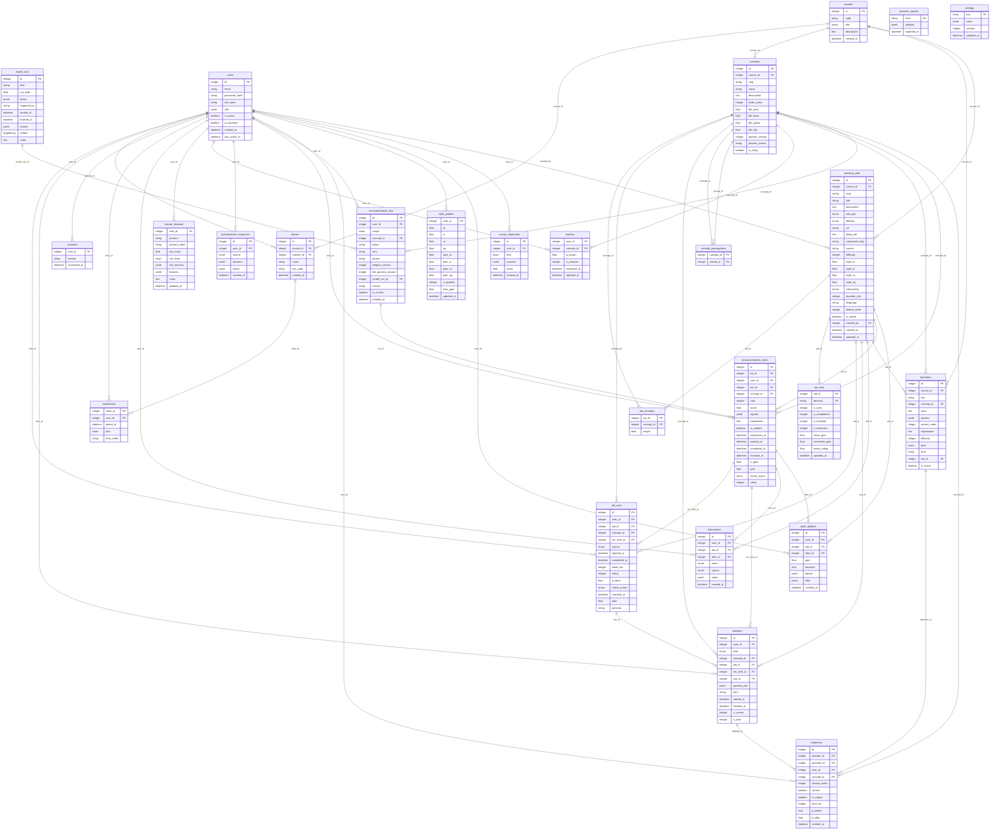

# Entity-relationship diagram

Generated from the SQLAlchemy models.

```mermaid
erDiagram
    courses {
        integer id PK
        string code
        string title
        text description
        datetime created_at
    }
    model_runs {
        integer id PK
        string kind
        date run_date
        enum status
        string triggered_by
        datetime started_at
        datetime finished_at
        jsonb metrics
        largebinary artifact
        text notes
    }
    research_reports {
        string kind PK
        jsonb payload
        datetime imported_at
    }
    settings {
        string key PK
        jsonb value
        integer version
        datetime updated_at
    }
    users {
        integer id PK
        string email
        string password_hash
        string full_name
        enum role
        boolean is_active
        boolean is_synthetic
        datetime created_at
        datetime last_active_at
    }
    classes {
        integer id PK
        integer course_id FK
        integer teacher_id FK
        string name
        string join_code
        datetime created_at
    }
    concepts {
        integer id PK
        integer course_id FK
        string slug
        string name
        text description
        integer order_index
        float bkt_prior
        float bkt_learn
        float bkt_guess
        float bkt_slip
        integer params_version
        string params_source
        boolean is_study
    }
    consents {
        integer user_id PK
        string version
        datetime consented_at
    }
    learner_features {
        integer user_id PK
        string persona
        string persona_label
        float risk_score
        enum risk_level
        jsonb risk_reasons
        jsonb features
        text notes
        datetime updated_at
    }
    questionnaire_responses {
        integer id PK
        integer user_id FK
        enum source
        jsonb answers
        jsonb vector
        datetime created_at
    }
    style_profiles {
        integer user_id PK
        float ar
        float si
        float vv
        float sg
        float prior_ar
        float prior_si
        float prior_vv
        float prior_sg
        integer n_updates
        float ema_gain
        datetime updated_at
    }
    survey_responses {
        integer id PK
        integer user_id FK
        enum kind
        jsonb answers
        float score
        datetime created_at
    }
    teaching_aids {
        integer id PK
        integer course_id FK
        string slug
        string title
        text description
        enum aid_type
        enum delivery
        string url
        text body_md
        string component_key
        string source
        integer difficulty
        float style_ar
        float style_si
        float style_vv
        float style_sg
        enum interactivity
        integer duration_min
        string language
        integer default_order
        boolean is_active
        integer created_by FK
        datetime created_at
        datetime updated_at
    }
    aid_concepts {
        integer aid_id PK
        integer concept_id PK
        float weight
    }
    aid_stats {
        integer aid_id PK
        string persona PK
        integer n_uses
        integer n_completions
        integer n_checked
        integer n_improved
        float mean_gain
        float smoothed_gain
        float mean_rating
        datetime updated_at
    }
    concept_prerequisites {
        integer concept_id PK
        integer prereq_id PK
    }
    enrollments {
        integer class_id PK
        integer user_id PK
        datetime joined_at
        enum arm
        string form_order
    }
    mastery {
        integer user_id PK
        integer concept_id PK
        float p_known
        integer n_answers
        datetime mastered_at
        datetime updated_at
    }
    questions {
        integer id PK
        integer course_id FK
        string key
        integer concept_id FK
        text stem
        jsonb options
        integer correct_index
        text explanation
        integer difficulty
        enum pool
        string form
        integer aid_id FK
        boolean is_active
    }
    recommendation_lists {
        integer id PK
        integer user_id FK
        enum scope
        integer concept_id FK
        string policy
        string arm
        string phase
        integer weights_version
        integer bkt_params_version
        integer model_run_id FK
        string reason
        boolean is_current
        datetime created_at
    }
    recommendation_items {
        integer id PK
        integer list_id FK
        integer user_id FK
        integer aid_id FK
        integer concept_id FK
        integer rank
        float score
        jsonb signals
        text explanation
        boolean is_explore
        datetime impression_at
        datetime opened_at
        datetime completed_at
        datetime checked_at
        float p_open
        float gain
        enum check_status
        integer rating
    }
    aid_uses {
        integer id PK
        integer user_id FK
        integer aid_id FK
        integer concept_id FK
        integer rec_item_id FK
        enum source
        datetime opened_at
        datetime completed_at
        integer dwell_sec
        integer rating
        float p_open
        enum check_status
        datetime checked_at
        float gain
        string persona
    }
    interactions {
        integer id PK
        integer user_id FK
        integer aid_id FK
        integer item_id FK
        enum event
        enum source
        jsonb value
        datetime created_at
    }
    style_updates {
        integer id PK
        integer user_id FK
        integer aid_id FK
        integer item_id FK
        float gain
        float baseline
        jsonb before
        jsonb after
        datetime created_at
    }
    attempts {
        integer id PK
        integer user_id FK
        enum kind
        integer concept_id FK
        integer aid_id FK
        integer rec_item_id FK
        integer use_id FK
        jsonb question_ids
        string form
        datetime started_at
        datetime finished_at
        integer n_correct
        integer n_total
    }
    responses {
        integer id PK
        integer attempt_id FK
        integer question_id FK
        integer user_id FK
        integer concept_id FK
        integer chosen_index
        boolean correct
        boolean is_repeat
        integer time_ms
        float p_before
        float p_after
        datetime created_at
    }
    aid_uses ||--o{ attempts : "use_id"
    attempts ||--o{ responses : "attempt_id"
    classes ||--o{ enrollments : "class_id"
    concepts ||--o{ aid_concepts : "concept_id"
    concepts ||--o{ aid_uses : "concept_id"
    concepts ||--o{ attempts : "concept_id"
    concepts ||--o{ concept_prerequisites : "concept_id"
    concepts ||--o{ concept_prerequisites : "prereq_id"
    concepts ||--o{ mastery : "concept_id"
    concepts ||--o{ questions : "concept_id"
    concepts ||--o{ recommendation_items : "concept_id"
    concepts ||--o{ recommendation_lists : "concept_id"
    concepts ||--o{ responses : "concept_id"
    courses ||--o{ classes : "course_id"
    courses ||--o{ concepts : "course_id"
    courses ||--o{ questions : "course_id"
    courses ||--o{ teaching_aids : "course_id"
    model_runs ||--o{ recommendation_lists : "model_run_id"
    questions ||--o{ responses : "question_id"
    recommendation_items ||--o{ aid_uses : "rec_item_id"
    recommendation_items ||--o{ attempts : "rec_item_id"
    recommendation_items ||--o{ interactions : "item_id"
    recommendation_items ||--o{ style_updates : "item_id"
    recommendation_lists ||--o{ recommendation_items : "list_id"
    teaching_aids ||--o{ aid_concepts : "aid_id"
    teaching_aids ||--o{ aid_stats : "aid_id"
    teaching_aids ||--o{ aid_uses : "aid_id"
    teaching_aids ||--o{ attempts : "aid_id"
    teaching_aids ||--o{ interactions : "aid_id"
    teaching_aids ||--o{ questions : "aid_id"
    teaching_aids ||--o{ recommendation_items : "aid_id"
    teaching_aids ||--o{ style_updates : "aid_id"
    users ||--o{ aid_uses : "user_id"
    users ||--o{ attempts : "user_id"
    users ||--o{ classes : "teacher_id"
    users ||--o{ consents : "user_id"
    users ||--o{ enrollments : "user_id"
    users ||--o{ interactions : "user_id"
    users ||--o{ learner_features : "user_id"
    users ||--o{ mastery : "user_id"
    users ||--o{ questionnaire_responses : "user_id"
    users ||--o{ recommendation_items : "user_id"
    users ||--o{ recommendation_lists : "user_id"
    users ||--o{ responses : "user_id"
    users ||--o{ style_profiles : "user_id"
    users ||--o{ style_updates : "user_id"
    users ||--o{ survey_responses : "user_id"
    users ||--o{ teaching_aids : "created_by"
```
